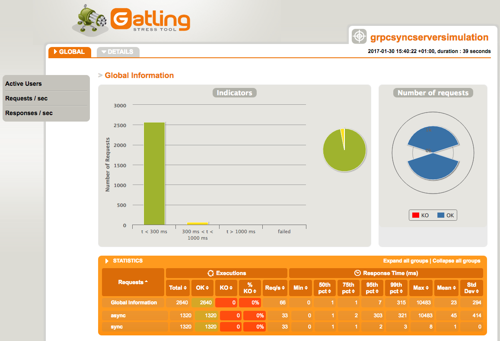
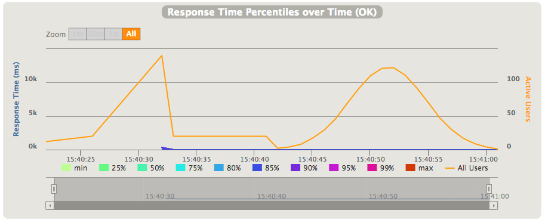

# Sample project to test gRPC based servers using Gatling

Terms:

1. [Gatling](http://gatling.io/) is an open-source load testing framework based on Scala, Akka and Netty 


2. [gRPC](http://www.grpc.io/) is a high performance, open-source universal RPC framework


#### Background

As one of [Tamedia](http://www.tamedia.ch/) projects required highly performable [HTTP/2](https://http2.github.io/) based
server with well defined API that can be used from various clients and from various programming languages,
[gRPC](http://www.grpc.io/) came up as good option. Everything was going fine in terms of development, but we found as
difficult to execute proper performance testing. Searching for the best way we found couple examples like
[https://github.com/smallnest/RPC-TEST] or [https://github.com/ExampleDriven/spring-boot-grpc-example] that didn't work
for us because they were to complecated to implement or they just didn't give us valuable results.

Once we looked at [Gatling](http://gatling.io/) we found it as nice and powerful solution, BUT :) 
[Gatling](http://gatling.io/) is mainly focused on [HTTP](http://gatling.io/docs/2.2.3/http/http_protocol.html) 
and supports [JMS](http://gatling.io/docs/2.2.3/jms.html).

What with [gRPC](http://www.grpc.io/)?

#### Solution

Fortunately, [Gatling](http://gatling.io/) gives you opportunity to build your own protocols that put us in right direction.
Bjorn Beskow’s article titled:
[“Creating a custom Gatling protocol for AWS Lambda](http://callistaenterprise.se/blogg/teknik/2016/11/26/gatling-custom-protocol/)”
just was right way and helped us to build protocol we can easily use to test any of our [gRPC](http://www.grpc.io/) calls.

Now we are able to do something like:

```scala
 val grpcConfig = GRPC()

  val grpcScenario = scenario("Test GRPC server")
      .exec(grpcCall(GrpcAsyncCallAction("async", host, port, json)).check(new GrpcCustomCheck((s: GeneratedMessage) => {
        s.asInstanceOf[LogResponse].message.equals("OK")
      })))
      .exec(grpcCall(GrpcSyncCallAction("sync", host, port, json)).check(new GrpcCustomCheck((s: GeneratedMessage) => {
        s.asInstanceOf[LogResponse].message.equals("OK")
      })))

  setUp(
    grpcScenario.inject(
       atOnceUsers(10),
       rampUsers(10) over(5 seconds),
       constantUsersPerSec(20) during(15 seconds),
       heavisideUsers(1000) over(20 seconds))
  ).protocols(grpcConfig)

```
The [_ch.tamedia.gatling.actions_](https://github.com/tamediadigital/grpc-gatling/tree/master/src/main/scala/ch/tamedia/gatling/actions) package contains [_GrpcExecutableAction_](https://github.com/tamediadigital/grpc-gatling/blob/master/src/main/scala/ch/tamedia/gatling/actions/GrpcExecutableAction.scala) trait and two traits that extends this one named 
[_GrpcExecutableAsyncAction_](https://github.com/tamediadigital/grpc-gatling/blob/master/src/main/scala/ch/tamedia/gatling/actions/GrpcExecutableAsyncAction.scala) and [_GrpcExecutableSyncAction_](https://github.com/tamediadigital/grpc-gatling/blob/master/src/main/scala/ch/tamedia/gatling/actions/GrpcExecutableSyncAction.scala). These two traits are important when we want to build Sync or Async 
test calls. The traits are used by [_GrpcActionActor_](https://github.com/tamediadigital/grpc-gatling/blob/master/src/main/scala/ch/tamedia/gatling/actions/GrcpActionActor.scala) in pattern matching when we have to handle response from
the server. Response can be _Option[GeneratedMessage]_ or _Future[GeneratedMessage]_ depending is it sync or async call.

This give us option just to implement specific actions such as 
[_GrpcSyncCallAction_](https://github.com/tamediadigital/grpc-gatling/blob/master/src/main/scala/ch/tamedia/gatling/actions/impl/GrpcSyncCallAction.scala)
and [_GrpcAsyncCallAction_](https://github.com/tamediadigital/grpc-gatling/blob/master/src/main/scala/ch/tamedia/gatling/actions/impl/GrpcAsyncCallAction.scala).

In order to validate response it is necessary to write your own Checkers such as one 
[_GrpcCustomCheck_](https://github.com/tamediadigital/grpc-gatling/blob/master/src/main/scala/ch/tamedia/gatling/GrpcCustomCheck.scala)

After all we are now able to get some nice Gatling result and we are able to test all of our [gRPC](http://www.grpc.io/) calls.






